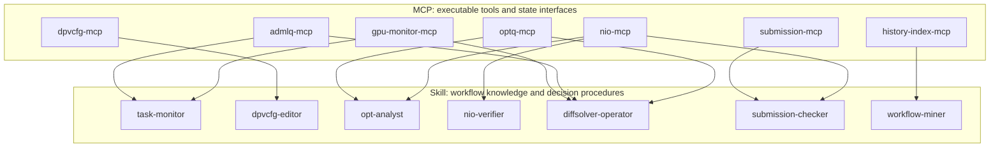
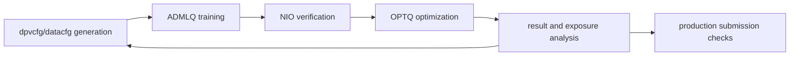

# MCP / Skill Workflow Summary

Date: 2026-06-07

Scope:
- Codex history: recent 30-day window from 2026-05-07 to 2026-06-06, using `~/.codex/sessions/2026/05` and `~/.codex/sessions/2026/06`.
- Project roots:
  - `/dat/usercache/xiongzhang/projects/2026/06/big_scale_model`
  - `/dat/usercache/xiongzhang/projects/versions/AutoDML/v1.2`
  - `/dat/usercache/xiongzhang/projects/versions/DynamicPV/v4.3.3`
  - `/dat/usercache/xiongzhang/projects/versions/OptTest/v0.4`
  - `/dat/usercache/xiongzhang/projects/versions/SubmissionCheck/v0.0`
- Bash history note: `.bash_history` has no timestamps, so it is used only as all-history supplementary evidence.

## Recommended MCP Categories

| MCP | Main Tools | Function |
|---|---|---|
| `admlq-mcp` | `adml.py`, `superrunOpt.py`, `superrunOpt_ADMLQ*.py`, `kill_superrunOpt.py`, `cancel_admlq_source.py` | Submit/cancel tasks, inspect `ADMLQ*` queues, count done/retry/failed states, check worker status. |
| `nio-mcp` | `checknio.py`, `comparenio.py`, `test_ckp.py`, `test_livehist.py` | Check NIO completeness, tratio, hist/live consistency, debug cfg and checkpoint behavior. |
| `optq-mcp` | `NNOPTQ_zz500`, `build_opt_summary.py`, `build_opt_rank.py`, `build_factor_exposure_summary.py`, `niupos2025` | Inspect OPTQ status, parse result files, summarize return/risk, analyze BarraStyle exposure. |
| `dpvcfg-mcp` | `config_search.py`, `modify_dpvcfg.py`, `compare_dpvcfg.py`, `check_datacfg.py`, `build_ensemble_seed_configs.py` | Generate, edit, compare, and validate dpvcfg/datacfg files and batch experiment configs. |
| `gpu-monitor-mcp` | `GpuStat.py`, `monitor_diffsolver_gpu.py`, `monitor_runpysim_timeout.py`, `diffsolver_runtime.py` | Monitor GPU state, diffsolver health, runpysim timeout/stall conditions. |
| `submission-mcp` | `production_converter.py`, `production_validate.py`, `generate_checkcfg.py`, `compare_hist_live_nio.py`, `upload_localmodel.py` | Convert experiment artifacts to production form, generate check cfg, validate hist/live consistency, upload local models. |
| `history-index-mcp` | `~/.codex/sessions`, `~/.codex/history.jsonl`, `.bash_history` | Mine recent workflows, command frequencies, common scripts, and recurring failure/retry patterns. |

## Recommended Skill Categories

| Skill | Depends On | Function |
|---|---|---|
| `task-monitor` | `admlq-mcp`, `gpu-monitor-mcp` | Decide whether a task is done, retrying, failed, stuck, or ready for acceptance. Existing skill can be strengthened. |
| `dpvcfg-editor` | `dpvcfg-mcp` | Edit dpvcfg files, generate XML batches, check freq/modelDecay/di_delay and XML/script consistency. Existing skill can be strengthened. |
| `opt-analyst` | `optq-mcp`, `nio-mcp` | Analyze optresult outputs, compare with baselines, judge value added and risk/exposure quality. Existing skill can be strengthened. |
| `nio-verifier` | `nio-mcp` | Specialized NIO acceptance workflow: tratio, dates, snaptime, live/hist alignment, debug entrypoints. Recommended new skill. |
| `diffsolver-operator` | `gpu-monitor-mcp`, `admlq-mcp`, `optq-mcp` | Run diffsolver experiments, monitor GPU/solver health, compare longshort/tvr/slack/loss variants. Recommended new skill. |
| `submission-checker` | `submission-mcp`, `nio-mcp` | Move from experiment artifacts to production submission: conversion, checkcfg generation, validation, hist/live NIO checks. Recommended new skill. |
| `workflow-miner` | `history-index-mcp` | Periodically summarize common scripts, workflows, command frequency, and recurring blockers from Codex/bash history. Recommended new skill. |

## Relationship Diagram

## Practical Rollout Order

1. Keep and strengthen existing skills: `task-monitor`, `dpvcfg-editor`, `opt-analyst`.
2. Add high-value operational skills: `nio-verifier`, `diffsolver-operator`, `submission-checker`.
3. Add the meta skill `workflow-miner` after the history/index MCP interface exists.
4. Implement MCPs around stable command wrappers first: `admlq-mcp`, `nio-mcp`, `optq-mcp`, `dpvcfg-mcp`.
5. Add environment-sensitive MCPs later: `gpu-monitor-mcp`, `submission-mcp`, `history-index-mcp`.

## Core Closed Loop

The main research/production loop is:

DiffSolver is a GPU optimization branch inside this loop, while AutoDML monitoring and run-decider logic provide the queue reliability layer.
